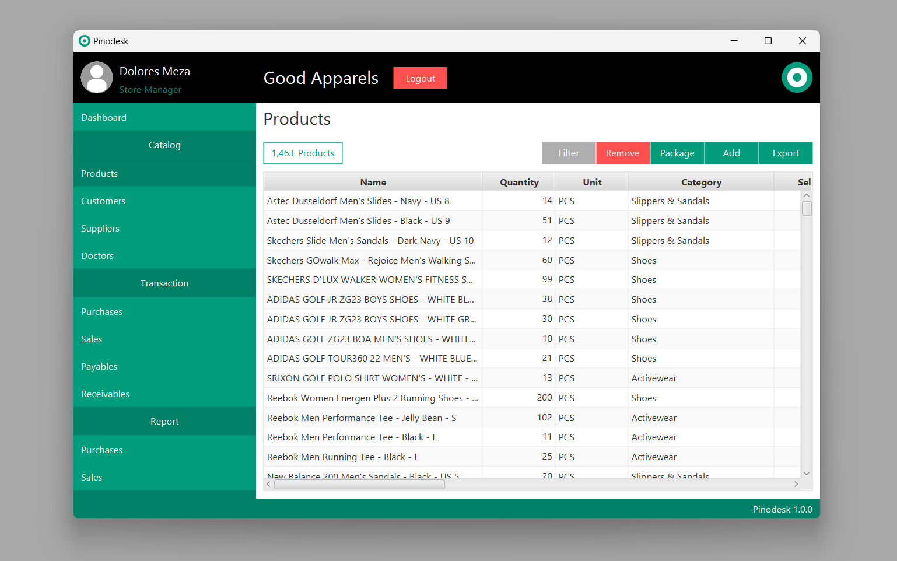

<div align="center" width="100%">
 

[](https://github.com/pinodesk/pinodesk/releases)
[](https://github.com/pinodesk/pinodesk/actions/workflows/ci.yml)
[](https://sonarcloud.io/summary/new_code?id=pinodesk_pinodesk)
[](https://sonarcloud.io/summary/new_code?id=pinodesk_pinodesk)
[](https://sonarcloud.io/summary/new_code?id=pinodesk_pinodesk)
[](https://github.com/pinodesk/pinodesk/blob/main/LICENSE)
</div>

# Open Source Point of Sale for Everyone

Pinodesk is a free, open-source, desktop-based Point of Sale system designed for retail businesses of all sizes. Build it yourself or download the installer, activate with a code sent to your email, and you're ready to manage your store. No licensing fees, no subscriptions, no vendor lock-in.

## Why Pinodesk?

- **Free and Open Source**. Full-featured POS software released under an open license. Use it for any business purpose without cost.
- **Offline-First**. Your data stays on your computer. No internet connection required after activation.
- **Cross-Platform**. Available for Windows and Linux with easy installation.
- **Hardware Compatible**. Works with standard barcode scanners and 58mm thermal printers from any brand. Just connect and start scanning.
- **Unlimited Data**. Store as much as your hardware allows. No cloud limits, no hidden caps.

## Features

| Feature | Description |
|---------|-------------|
| **Retail-Focused** | Manage thousands of products with flexible categories tailored to your business |
| **Smart Dashboard** | Real-time insights on sales performance, best and lowest selling products, and upcoming payables/receivables due dates |
| **Product Import/Export** | Bulk import products from Excel templates; export data for reporting or migration |
| **Package Products** | Create bundles that automatically deduct inventory when sold |
| **Expiry Management** | Track expiration dates for perishable goods, especially useful for pharmacies |
| **Sales & Purchase Reports** | Filterable reports exportable to Excel for deeper analysis |
| **User Group Permissions** | Control access to features based on user roles |
| **Pharmacy Mode** | Specialized features for drugstores including doctor data management |



## Getting Started

### Quick Start

1. **Download**. Get the installer for your platform from [pinodesk.com/en/download](https://www.pinodesk.com/en/download).
2. **Install**. Run the installer and follow the setup wizard. No server or database configuration needed.
3. **Activate**. Enter your email on the activation screen. An activation code will be sent to you.
4. **Start Selling**. That's it. Begin adding products and processing transactions.

### Hardware Requirements

Pinodesk works with any standard POS hardware:

- **Barcode Scanner**. Any USB or Bluetooth scanner that your operating system recognizes
- **Thermal Printer**. Standard 58mm ESC/POS-compatible printers
- **Computer**. Windows or Linux with Java Runtime (bundled in installer)

> **Note:** You provide your own hardware. Pinodesk doesn't include or require proprietary devices.

## Architecture & Tech Stack

Pinodesk is built with proven, reliable technologies:

| Layer | Technologies |
|-------|-------------|
| **UI Framework** | JavaFX with FXML templates |
| **Database** | H2 embedded database (MySQL mode) with Flyway migrations |
| **Backend** | Spring Framework (JDBC, Caching, Transactions) |
| **Build** | Maven with multi-profile packaging (currently only EXE and DEB) |
| **Architecture** | Layered: Entities > Repositories > Services > Controllers |
| **Libraries** | Lombok, Unirest (HTTP), Jackson (JSON), Pinodesk libraries |

### Project Structure

```
src/main/java/com/pinodesk/
├── entity/          # Data models with Lombok
├── repository/      # Spring Data JDBC interfaces
├── service/         # Business logic with caching
├── controller/      # JavaFX FXML controllers
├── viewmodel/       # DTOs for UI binding
└── constant/        # Enums and centralized constants
```

## Contributing

Pinodesk is under active development and welcomes contributions from the community. Whether you're fixing bugs, adding features, or improving documentation, your help makes this project better.

See [CONTRIBUTING.md](CONTRIBUTING.md) for:
- Development setup instructions
- Coding standards and conventions
- Pull request guidelines
- Project architecture details

## Documentation & Support

- **Documentation**: [pinodesk.com/en/documentation](https://www.pinodesk.com/en/documentation)
- **FAQ**: [pinodesk.com/en/documentation/faq](https://www.pinodesk.com/en/documentation/faq/)
- **Website**: [pinodesk.com](https://www.pinodesk.com/en)
